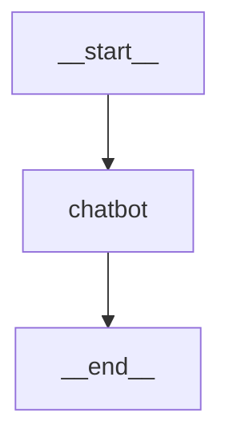

# LangGraph 入门：快速开始

本篇将带你从零搭建 LangGraph 开发环境，并构建一个简单的对话机器人，帮助你理解 LangGraph 的核心工作方式。

## 什么是 LangGraph？

LangGraph 是一个用于构建**有状态、多步骤 LLM 应用**的 Python 框架。它的核心思想是将应用逻辑建模为一个**有向图**：

- **节点（Node）**：执行具体逻辑的函数（调用 LLM、处理数据等）
- **边（Edge）**：定义节点之间的执行顺序
- **状态（State）**：在节点之间传递和累积的数据

```
[START] → [节点A] → [节点B] → [END]
```

与传统的链式调用（Chain）不同，LangGraph 支持**循环、条件分支、并行执行**等复杂流程，非常适合构建 Agent。

## 环境安装

### 1. 创建项目

```bash
mkdir langgraph-tutorial && cd langgraph-tutorial
python -m venv .venv
source .venv/bin/activate  # Windows: .venv\Scripts\activate
```

### 2. 安装依赖

```bash
pip install langgraph langchain-openai python-dotenv
```

::: tip 包说明
- `langgraph`：核心框架
- `langchain-openai`：OpenAI 模型接入（也可替换为其他模型提供商）
- `python-dotenv`：环境变量管理
:::

### 3. 配置 API Key

创建 `.env` 文件：

```env
OPENAI_API_KEY=sk-your-api-key-here
OPENAI_BASE_URL=https://api.openai.com/v1  # 可替换为代理地址
```

## 第一个 LangGraph 应用

我们来构建一个简单的对话机器人。

### 步骤一：定义状态

状态是在图的所有节点之间共享的数据结构：

```python
from typing import Annotated
from typing_extensions import TypedDict
from langgraph.graph.message import add_messages

class State(TypedDict):
    messages: Annotated[list, add_messages]
```

这里使用了 `Annotated` 和 `add_messages`，意思是每次更新 `messages` 字段时，新消息会**追加**到列表末尾，而不是覆盖。

### 步骤二：创建图并添加节点

```python
from langgraph.graph import StateGraph, START, END
from langchain_openai import ChatOpenAI
from dotenv import load_dotenv

load_dotenv()

llm = ChatOpenAI(model="gpt-4o-mini")

def chatbot(state: State):
    response = llm.invoke(state["messages"])
    return {"messages": [response]}

graph_builder = StateGraph(State)
graph_builder.add_node("chatbot", chatbot)
```

### 步骤三：定义边并编译

```python
graph_builder.add_edge(START, "chatbot")
graph_builder.add_edge("chatbot", END)

graph = graph_builder.compile()
```

`START` 和 `END` 是特殊节点，表示图的入口和出口。编译后的 `graph` 就是一个可执行的应用。

### 步骤四：运行

```python
result = graph.invoke({
    "messages": [{"role": "user", "content": "你好，请介绍一下你自己"}]
})

print(result["messages"][-1].content)
```

## 完整代码

```python
from typing import Annotated
from typing_extensions import TypedDict
from langgraph.graph import StateGraph, START, END
from langgraph.graph.message import add_messages
from langchain_openai import ChatOpenAI
from dotenv import load_dotenv

load_dotenv()

class State(TypedDict):
    messages: Annotated[list, add_messages]

llm = ChatOpenAI(model="gpt-4o-mini")

def chatbot(state: State):
    response = llm.invoke(state["messages"])
    return {"messages": [response]}

graph_builder = StateGraph(State)
graph_builder.add_node("chatbot", chatbot)
graph_builder.add_edge(START, "chatbot")
graph_builder.add_edge("chatbot", END)

graph = graph_builder.compile()

def main():
    print("LangGraph 聊天机器人（输入 quit 退出）")
    while True:
        user_input = input("\n你: ")
        if user_input.lower() == "quit":
            break

        result = graph.invoke({
            "messages": [{"role": "user", "content": user_input}]
        })
        print(f"AI: {result['messages'][-1].content}")

if __name__ == "__main__":
    main()
```

## 可视化图结构

LangGraph 支持将图导出为 Mermaid 图表：

```python
print(graph.get_graph().draw_mermaid())
```

输出：



你也可以生成图片：

```python
from IPython.display import Image, display

display(Image(graph.get_graph().draw_mermaid_png()))
```

## 核心概念回顾

| 概念 | 说明 |
|------|------|
| `StateGraph` | 图的构建器，接受状态类型作为参数 |
| `State` | 用 TypedDict 定义的状态结构 |
| `add_node()` | 向图中添加一个节点 |
| `add_edge()` | 定义节点间的执行顺序 |
| `compile()` | 编译图，生成可执行对象 |
| `invoke()` | 执行图，传入初始状态 |
| `START` / `END` | 特殊节点，标记图的入口和出口 |

## 小结

本篇我们完成了：

1. 搭建了 LangGraph 开发环境
2. 理解了图的三大核心：**状态、节点、边**
3. 构建了一个简单的对话机器人

当前的机器人还很简单——每次对话都是独立的，没有记忆。下一篇我们将深入学习**状态管理与图结构**，让应用具备真正的对话能力。

::: tip 下一篇
[LangGraph基础：状态与图结构](./2.LangGraph基础：状态与图结构) — 深入理解 StateGraph 的状态定义、Reducer 和图的生命周期。
:::
